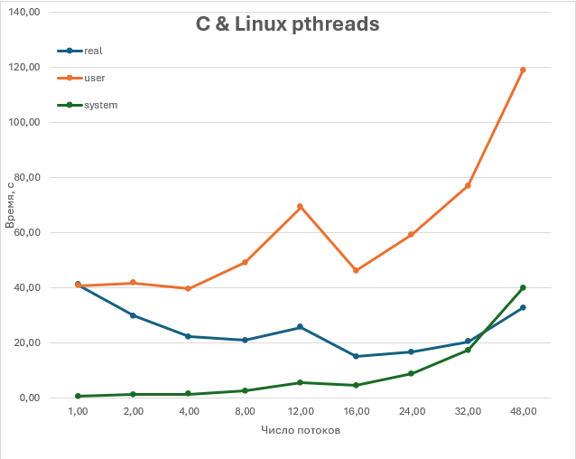
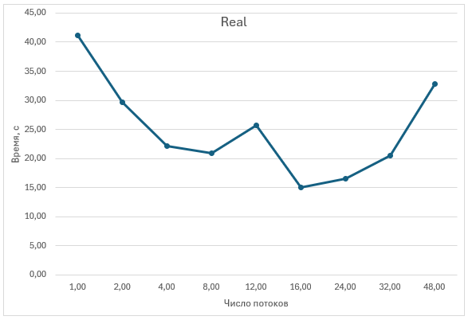
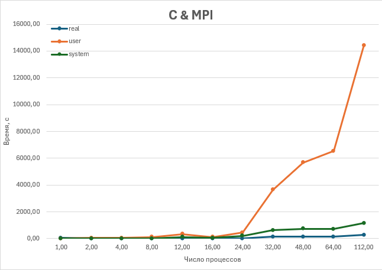
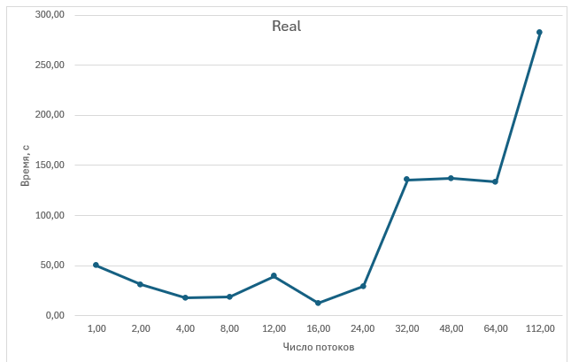
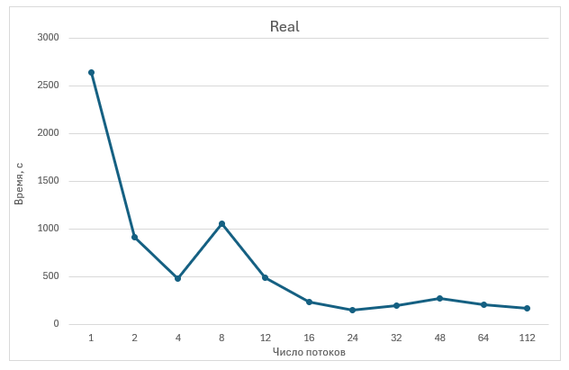
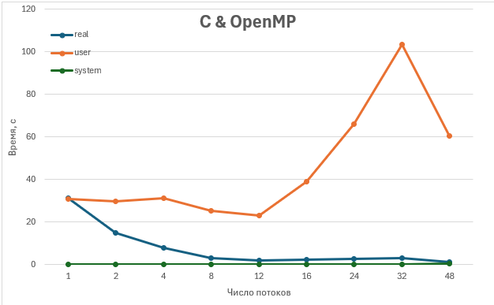
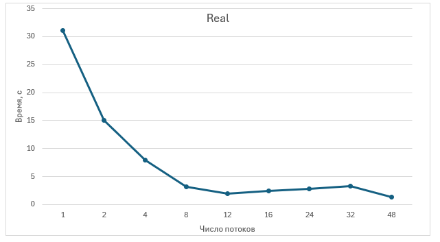

# Cтабилизированный метод бисопряжённых градиентов

[Read in English](README.md)

Репозиторий содержит реализации метода BiCGStab для решения разрежённых систем линейных алгебраических уравнений (СЛАУ) на суперкомпьютере в нескольких моделях параллелизации: C/pthreads, C/MPI, Python/mpi4py и C/OpenMP.

## Постановка задачи

Рассматривается СЛАУ вида Ax = b, где A — матрица коэффициентов размерности n×n, x — вектор неизвестных, b — вектор правых частей.  
Матрица A считается разреженной, если большинство её элементов равны нулю. Хранение плотной матрицы требует O(n²) памяти и приводит к избыточным вычислениям над нулевыми элементами, что неэффективно для больших разрежённых систем.

## Обоснование выбора метода

Для разреженных СЛАУ используются прямые и итерационные методы.  
Прямые методы (LU‑разложение, разложение Холецкого) страдают от заполнения: при разложении появляются новые ненулевые элементы, резко увеличивая требования к памяти и времени, что делает их непрактичными для больших высокоразреженных матриц.  

Итерационные методы строят последовательность приближений, опираясь на операции умножения разреженной матрицы на вектор и векторную алгебру, что хорошо подходит для больших систем и параллельных архитектур.  
В работе используется метод BiCGStab, эффективный для общих (в том числе несимметричных) разреженных СЛАУ. Основная операция — умножение матрицы на вектор со сложностью O(nnz), где nnz — число ненулевых элементов, что существенно дешевле, чем O(n²) для плотных матриц.  

Метод естественно распараллеливается: умножение матрицы на вектор выполняется по строкам, векторные операции независимы, а скалярные произведения требуют только глобальных редукций.

## Алгоритм BiCGStab (кратко)

На вход подаются матрица A, вектор правых частей b, начальное приближение x₀ и заданная точность ε по норме невязки.  
Алгоритм итеративно обновляет решение xₖ, невязку rₖ и вспомогательные векторы (pₖ, vₖ, sₖ, tₖ), используя два умножения матрицы на вектор на итерацию, скалярные произведения и редукции.  

Итерации продолжаются до выполнения критерия остановки по норме невязки ||rₖ|| < ε или наступления особых ситуаций (например, слишком малое значение ρₖ).  
Результатом является приближённое решение x, удовлетворяющее заданной точности.

## Постановка эксперимента

Во всех экспериментах использовалась одна и та же разреженная трёхдиагональная матрица размерности n.  
Для каждого внутреннего ряда на главной диагонали стоят элементы 2, а на под- и наддиагонали — элементы −1.  

Вектор правых частей b выбирался как вектор из единиц, начальное приближение x₀ — нулевой вектор.  
Критерий остановки: погрешность по норме невязки ε = 1e−10.

*(Здесь можно вставить обобщающие графики по времени/ускорению для всех реализаций.)*

## Реализация на C с pthreads

Реализация на pthreads использует общую память и создаёт пул потоков, между которыми по строкам делится разреженная матрица при операции SpMV.  
Скалярные произведения рассчитываются через частичные суммы в потоках и их редукцию в главном потоке, тогда как векторные обновления выполняются последовательно, поскольку занимают малую долю общего времени.  

В экспериментах наблюдается ускорение вплоть до 16 потоков. После этого прирост прекращается, а время real начинает расти из‑за увеличения системных накладных расходов (синхронизация, барьеры) и нагрузки на подсистему памяти.  

## Реализация на C с MPI

Реализация на C/MPI распределяет строки матрицы и соответствующие элементы векторов между процессами.  
Согласование скалярных произведений и норм выполняется через коллективные операции, при этом основная параллельность достигается за счёт локального SpMV по своим строкам и параллельного расчёта локальных скалярных произведений.  

Лучшее масштабирование по времени реального выполнения достигается примерно до 8–16 процессов.  
При дальнейшем увеличении числа процессов выигрыш по real‑времени уменьшается, а system‑время резко растёт из‑за стоимости коллективных коммуникаций и увеличения объёма обмена данными между процессами.  

## Реализация на Python с mpi4py

Реализация на Python с использованием mpi4py повторяет схему C/MPI: матрица и векторы разбиваются по строкам между процессами, локальный SpMV и скалярные произведения вычисляются средствами NumPy, а глобальные величины и направления собираются через коллективные операции.  

При том же числе процессов эта реализация показывает существенно большее время real по сравнению с C‑вариантами из‑за накладных расходов интерпретатора и Python‑уровневых структур данных.  
При этом характер зависимости времени от числа процессов сохраняет ту же общую тенденцию, что и у реализации на C/MPI.  

## Реализация на C с OpenMP

Реализация на OpenMP использует общую память и распараллеливает основные части алгоритма директивами компилятору.  
Операции SpMV, скалярные произведения и векторные обновления оформлены как параллельные циклы с редукциями.  

Реализация на C/OpenMP демонстрирует наилучшее время решения среди рассмотренных вариантов на умеренном числе потоков (примерно 8–16), обеспечивая значительное ускорение по сравнению с однопоточным запуском.  
Системные накладные расходы оказываются ниже, чем у вариантов с pthreads и MPI. Аномалия при 48 потоках связана с особенностями сходимости метода при другом разбиении матрицы.  

## Выводы

Для выбранной задачи (SpMV‑ориентированный метод BiCGStab на разреженной трёхдиагональной матрице) наибольшую эффективность показывают реализации в модели общей памяти, в первую очередь OpenMP, на умеренном числе потоков.  
Масштабирование по большому числу процессов/потоков ограничивается стоимостью синхронизации, коллективных операций и особенностями подсистемы памяти.
